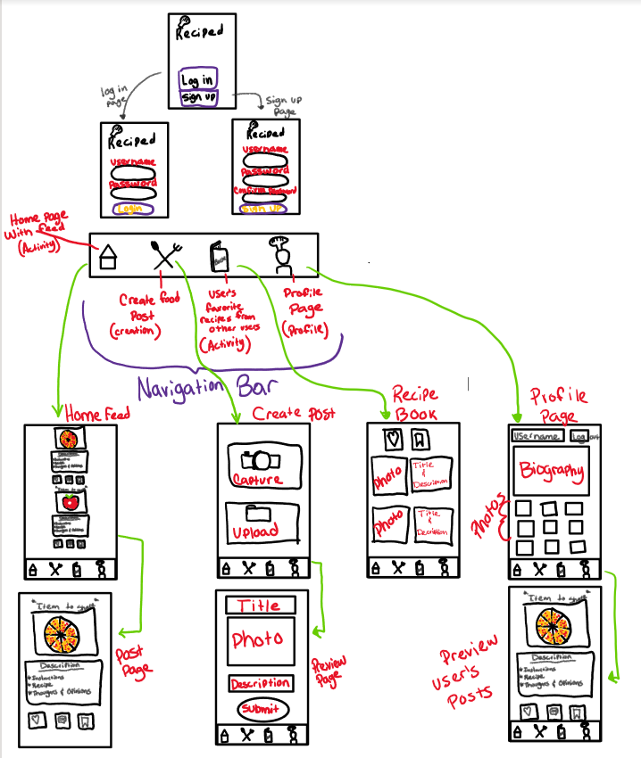

Reciped - README Template
===

# Reciped

## Table of Contents
1. [Overview](#Overview)
1. [Product Spec](#Product-Spec)
1. [Wireframes](#Wireframes)
2. [Schema](#Schema)

## Overview
### Description
Reciped is a app that allows users to post their recipes: photos, ingredients, and steps on how to make the item. Then other users can view these posts and try them out then make a review on them.

### App Evaluation
[Evaluation of your app across the following attributes]
- **Category:** Social Media
- **Mobile:** Record/ post videos, message friends
- **Story:** Allow users to share their recipes with the world and others can create them
- **Market:** Cooks and noncooks both looking to try and create new food.
- **Habit:** Users will be able to post any food they make whenver they feel like sharing their recipes, as well as viewing others' recipes.
- **Scope:** Medium level app, like instagram clone

## Product Spec

### 1. User Stories (Required and Optional)

**Required Must-have Stories**

* User login / signup page
* Main pages
    * Homepage: where you can see everyones posts
    * Createpage: where you can create a post of your recipes (pictures, videos, other descriptions)
    * Recipe Book page: shows all of the liked/saved recipes
    * Profile page: contain all posts of user, can also logout 

**Optional Nice-to-have Stories**

* Explore page: can find other recipes, based on categories

### 2. Screen Archetypes

* Login
* Register
   * When first opening, the user is prompted to either signup if new, or login if they already have an account
* Stream
    * Users will be able to view recipe posts of their own or from other users. Here users can save/favorite recipes they like or want to try.
* Creation
    * Here users are able to upload pictures or take pictures of their creation. After that they are able to attach a description containing the ingridients and how they cooked it.
* Profile
    * Contains the users basic info such as username and posts created
* Recipe Book Screen
    * Users will be able to view past recipes from other users that they favorited/liked and go back to them.

### 3. Navigation

**Tab Navigation** (Tab to Screen)

* Home
* Create
* Recipe Book
* Profile

**Flow Navigation** (Screen to Screen)

* Login -> users will have to either sign up or login to their account
* Home -> Opens up stream of posts
* Create -> Opens up create screen to take or upload images  
* Recipe book -> Shows a screen simialr to the stream page, but only for favorited recipes
* Profile -> Shows the users posts

## Wireframes

### [BONUS] Digital Wireframes & Mockups

### [BONUS] Interactive Prototype

## Schema 
### Models
#### Post

   | Property      | Type     | Description |
   | ------------- | -------- | ------------|
   | objectId      | String   | unique id for the user post (default field) |
   | user          | Pointer to User| user of post |
   | image         | File     | image that user posts |
   | title         | String   | title of post |
   | description   | String   | ingredients, steps, and description of post |
   | comment       | String   | comment of post |
   | likesCount    | Number   | number of likes for the post |
   | save          | Boolean  | saved post to recipe book |
   | createdAt     | DateTime | date when post is created (default field) |  
### Networking
#### List of network requests by screen
   - Home Feed Screen
      - (Read/GET) Query all posts of all users
      - (Create/POST) Create a new like on a post
      - (Delete) Delete existing like
      - (Create/POST) Create a new comment on a post
      - (Delete) Delete existing comment
      - (Create/POST) Save a new post
      - (Delete) Unsave post
   - Create Screen
      - (Create/POST) Create a new post object
   - Recipe Book Screen
      - (Read/GET) Query all saved posts of user
   - Profile Screen
      - (Read/GET) Query all posts of user
      - (Read/GET) Query logged in user object

